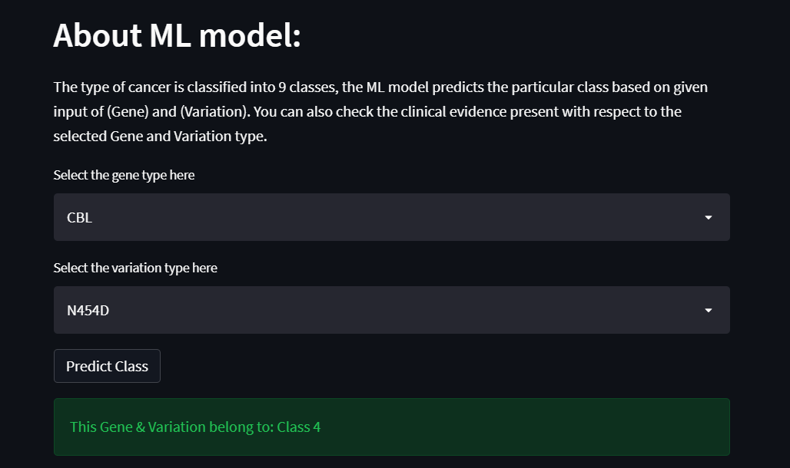
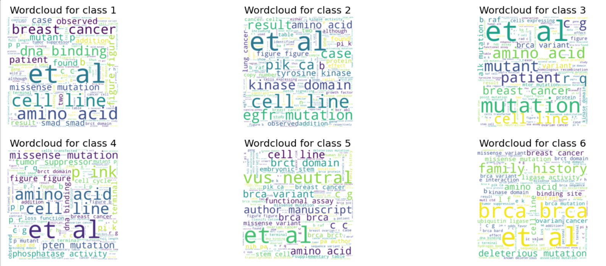
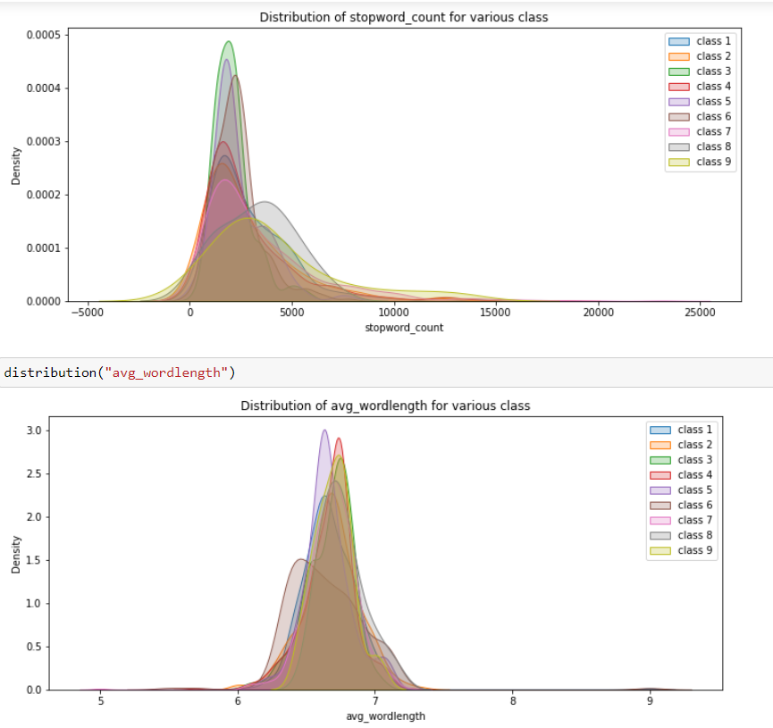
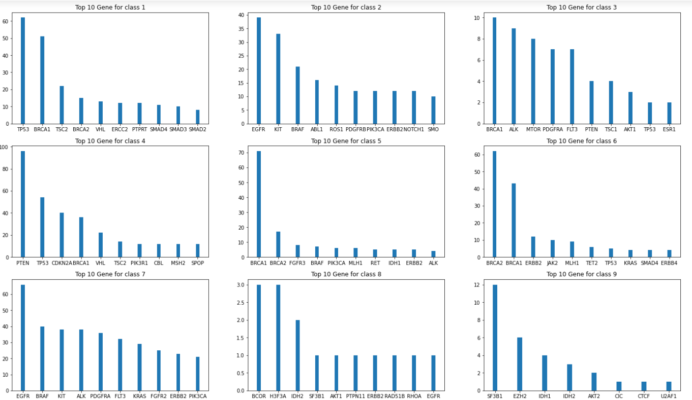
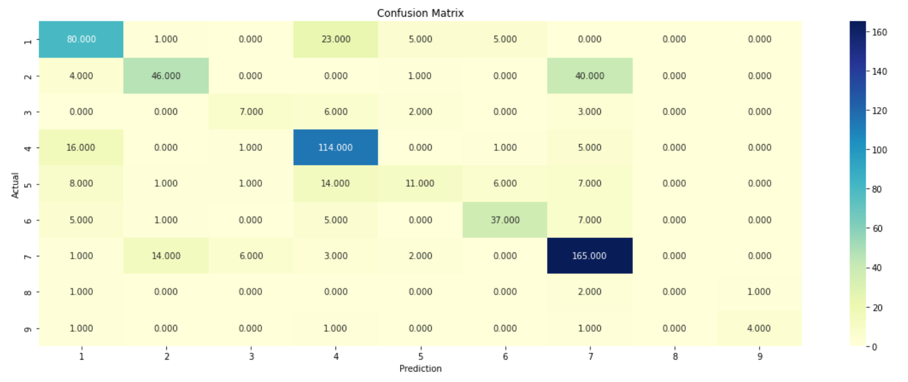
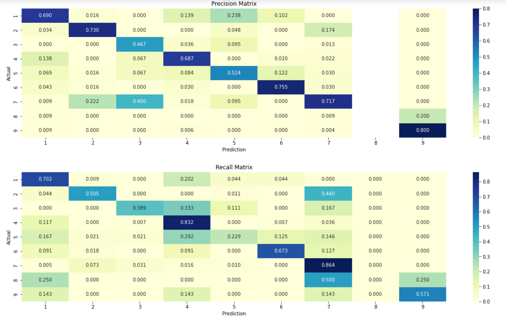
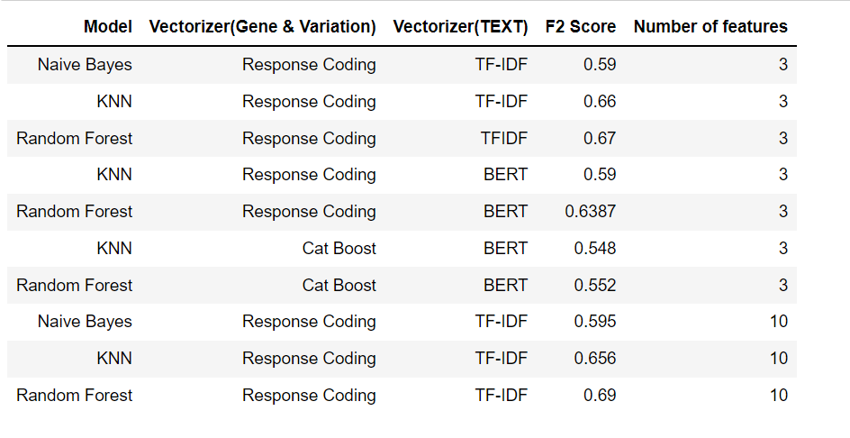

# Cancer Diagnosis System

Genes in our body control how your cells work by making proteins.
All types of Cancer begin when one or more genes in a cell mutate(changes).
An abnormal protein can cause cells to multiply uncontrollably and become cancerous. A mutation may be beneficial, harmful, or neutral. This depends where in the gene the change occurs.

In this project, I have made a model which takes the features 'Gene', 'Variation' and with the help of clinical evidence (text data) it
predicts the Cancer class. The dataset contains 9 different types of classes and since in medical domain it is important to reduce false negatives, I have used the "F2 Score" metric to evaluate the model performance.
I have used various methods to vectorize both categorical and text data to get high F2 score and also used multiple models to see the best one!

## Acknowledgements

 - [How Genes Work](https://www.cancer.net/navigating-cancer-care/cancer-basics/genetics/genetics-cancer)
 - [Different types of Mutations](https://www.youtube.com/watch?v=qxXRKVompI8)

## Demo Screenshots

## Demo

https://final-cancer-model.herokuapp.com/

## Data Overview

The dataset has been obtained from: [https://www.kaggle.com/competitions/msk-redefining-cancer-treatment/data]

⚪Clinical Evidence: This is a text data which the human specialists rigorously go through to classify the genetic mutations.
This is an important feature and our model heavily depends on this for its classification task.

⚪Gene: This tells us about the gene where the mutation is located. This is a categorical feature.

⚪Variation: This gives us an idea about the aminoacid changes for the mutation.

## Technical approach for classification

👉Data Cleaning: The categorical features have no missing values.

For the text data, stopwords are removed and lemmatization has been applied as it returns the dictionary form of the word.
I have avoided using porter/snowball stemmer as it returns the root form of the word which sometimes has different spelling or doesn't have 
any proper meaning attached to it and in medical domain even one word could dictate or
change the whole meaning of the text.

👉Data visualisation:

⚪ Bar plots for distribution of classes. 

⚪ Bar plots for categorical features. 

⚪ Confusion matrix, matrices for precision & recall. The precision and recall matrices help us to identify the classes where
our model is poorly predicting.

⚪ Distribution of extracted features for each class.

⚪ Wordcloud for TEXT, corresponding to each class.

👉Data Preprocessing:

I have employed 2 methods for vectorizing categorical data:

1) CatBoost Encoder.

2) Response Coding.

⚪ TFIDF vectorization on 'text'. 

⚪ Sentence vector through BERT on 'text'. 

👉Model:
1) Naive Bayes
2) KNN
3) Random Forest

## 🛠 Skills
Python, Feature Engineering, Hyperparameter Tuning (Optuna), Streamlit, Heroku.

## Results
The following table summarizes the F2 Score obtained by trying out different approaches. We see, that Random Forest with Response Coding & TFIDF vectorizer is a clear winner here!!

 

