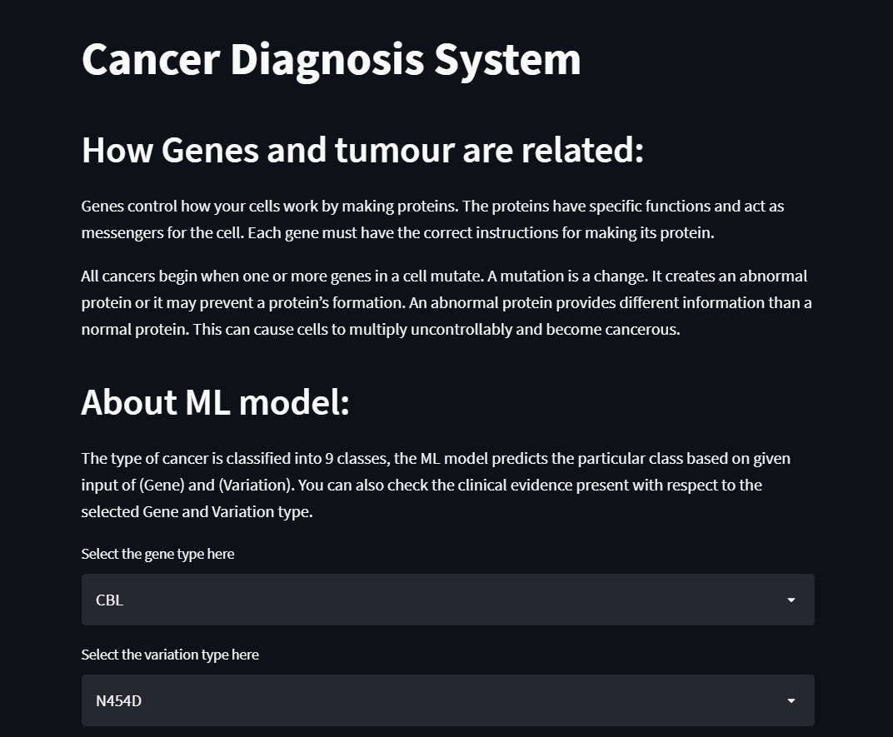

# Cancer Diagnosis System

Genes in our body control how your cells work by making proteins.
All types of Cancer begin when one or more genes in a cell mutate(changes).
An abnormal protein can cause cells to multiply uncontrollably and become cancerous. A mutation may be beneficial, harmful, or neutral. This depends where in the gene the change occurs.

In this project, I have made a model which takes the features 'Gene', 'Variation' and with the help of clinical evidence (text data) it
predicts the Cancer class. The dataset contains 9 different types of classes and hence the metric used to check the model
performance is 'multi class log-loss' and based on the lowest log-loss that I have got after
trying out multiple models, I finally use 'Logistic Regression' with Calibration for fitting the train data.  

## Acknowledgements

 - [How Genes Work](https://www.cancer.net/navigating-cancer-care/cancer-basics/genetics/genetics-cancer)
 - [Different types of Mutations](https://www.youtube.com/watch?v=qxXRKVompI8)

## Screenshots

## Demo

https://final-cancer-model.herokuapp.com/

## Motivation

This is my first data science project and I always wondered as to how Machine Learning 
can be helpful in healthcare domain. So, I picked up this intermediate classification problem wherein a human
specialist has to go through long paragraphs of data to classify the genetic mutations and this sometimes takes a lot of time.
Hence, I thought of making a model which saves time of the human expert by predicting the cancer class with the help of text data (evidence).

## Data Overview

The dataset has been obtained from: [https://www.kaggle.com/competitions/msk-redefining-cancer-treatment/data]

⚪Clinical Evidence: This is a text data which the human specialists rigorously go through to classify the genetic mutations.
This is an important feature and our model heavily depends on this for its classification task.

⚪Gene: This tells us about the gene where the mutation is located. This is a categorical feature.

⚪Variation: This gives us an idea about the aminoacid changes for the mutation.s2
## Technical approach for classification

👉Data Cleaning: The categorical features have no missing values.

For the text data, stopwords are removed and lemmatization has been applied as it returns the dictionary form of the word.
I have avoided using porter/snowball stemmer as it returns the root form of the word which sometimes has different spelling or doesn't have 
any proper meaning attached to it and in medical domain even one word could dictate or
change the whole meaning of the text.

👉Data visualisation:

⚪ Bar plots for distribution of classes. Through this plot we come to know that the
dataset is an imbalanced one.

⚪ Bar plots for categorical features. This tells us about the number of occurence of Gene & Variation.

⚪ Confusion matrix, matrices for precision & recall. The precision and recall matrices help us to identify the classes where
our model is poorly predicting.

👉Data Preprocessing:

I have employed 2 methods for vectorizing categorical data:

1) One hot encoding.

2) Response Coding.

⚪Response coding: Here, for each categorical feature a 9 dimensional vector is made
which consists of probability values of that particular feature belonging to the different class. This vector has values such that they sum upto (1).

Suppose the 'Gene' feature belongs to 'class 2' then the vector for this 'Gene' feature has high probability value
corresponding to its second dimension.
This featurization technique reduces large dimensionality of the model which otherwise would be present if I go for one hot encoding.

⚪ TFIDF vectorization on 'text'. I also performed Bag of words for this feature but the log-loss value obtained was more than when TFIDF was applied. 

👉Model:

⚪ Random model: This model gives us a log-loss which we use as score that our model has to beat
by securing a log-loss value less than what the random model gives.

⚪ Logistic Regression: After trying out various models I got lowest value for the log-loss with this model. 
As Calibration is also applied on top of this model it gives us probability values for each class which helps us for getting model interpretability!!

⚪ Random Forest: This model works fairly well on the given data as it gives less log-loss than the random model but slightly more than
Logistic Regression.

👉Prettytable: The table summmarizes various log-loss values obtained by using different featurization techniques and 
the two models.

## 🛠 Skills
Python, Feature Engineering, Hyperparameter Tuning, Streamlit, Heroku.

## Results
The following table summarizes the log-loss values obtained by trying out different approaches. We see, that Logistic Regression is a clear winner here!!

## Lessons Learned

1) Performing response coding for multi-class classification.
2) Developing matrices for precision and recall.
3) Getting model interpretability by using Calibration over a model.
4) Hyperparameter tuning:
(SGD Classifier, GridSearchCV, RandomizedSearchCV)      

 

